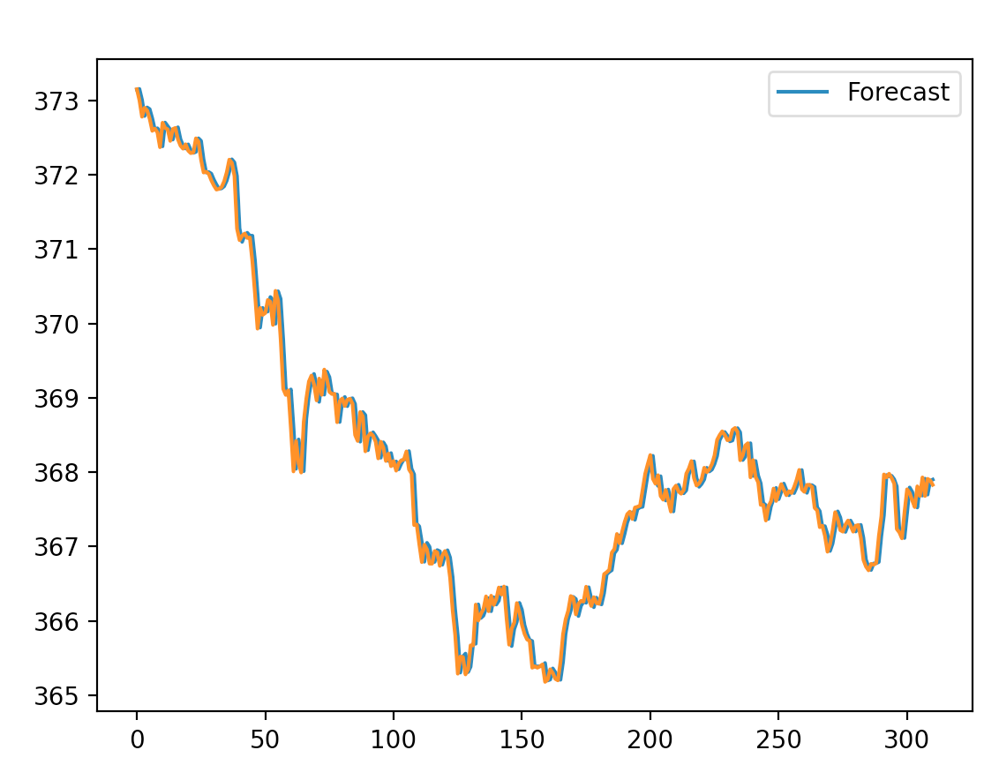
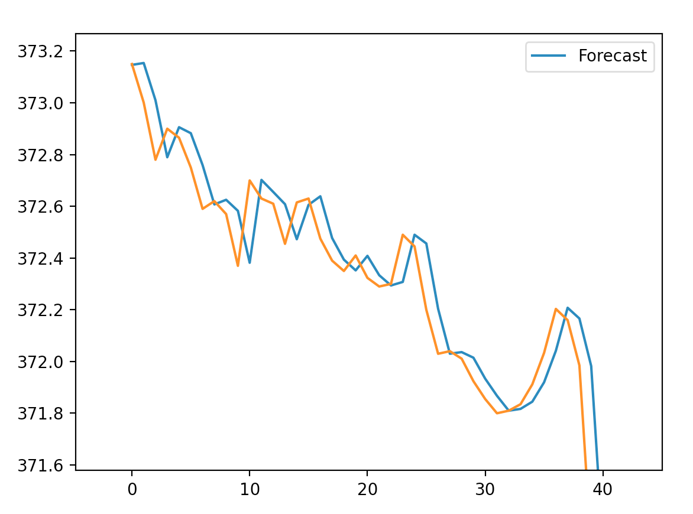

# WerbelbPersonalProject

## Instructions for Running Project
In order to run this project, you will need [python](https://www.python.org/downloads/) and [pip](https://pip.pypa.io/en/stable/installing/) installed on your computer.

You will also need certain python modules installed, which you can find in [requirements.txt](/requirements.txt).

To run the actual program, use the following command in Terminal from the root of this downloaded repository. It might take some time to start, but be patient and it should eventually start up.
```
python script.py
```

You can stop the program by using `CTRL-C` or just closing the terminal window.

## Journels

### 12/22/2020

> Today was my first day of actual coding, and I got quite a bit done. After a couple of days trying to find a free API I could use to get data from the stock market, I finally found "finnhub.io" at the end of yesterday, and was able to start experimenting with it today. Using this data, I was able to create a simulation of the SPDR S&P 500 Trust ETF (SPY), an ETF tracking the S&P 500. In my simulation, I can start with a certain amount of total money (I've been using $500), of which I can invest a certain amount in the ETF. The simulation updates every second, at which time it finds the current price of a single stock in the ETF and uses that to calculate the total amount of money I have right now as well as my total gains from the start of the simulation. I then made invest and divest methods I can use to put in or take money from the ETF, which changes the amount of risk and reward possible. One part of this simulation I am especially proud of is my "savedInfo.json" file, which allows me to stop and start the simulation and not lose any progress. Hopefully during my next session, I will be able to start programming the ML necessary to determine the best times to invest and divest.

### 12/23/2020
> I spent most of this session with historical data, as opposed to yesterday when I was working with realtime data. I first set up a way to get historical data, still with finnhub.io, using Stock Candles, which I will be able to use as data when training my ML model. I then realized that I could also use this data in my simulation instead of current data, which is especially helpful when the market is closed and I am not getting any realtime data. To do this, I set up a python dictionary with timestamps and stock closes one minute apart from each other. I then made a different "simCurrentPrice" method in the simulator that iterates over that dictionary and substitutes the closes for realtime prices. In the constructor for the class, I put a boolean variable that is used throughout to figure out whether to use the realtime price or the historical prices.
> 
> I did make a couple other small changes that I might as well point out. First, I moved a lot of the code from the python script to the constructor of the Simulator class, just to clean up the script. Second, I added the savedInfo.json to the gitignore because it will probably change very often and does not need to be kept in my Github Repository. Third, I added a "delta gain" to what is printed in the simulator update method, which tells how much money was gained or lost since the previous update. One final thing to touch on is that I did get a very basic start on creating my ML model, but as it is not even close to starting to work, I will wait to commit that until it's ready.

### 1/4/2021
> This session, I started building my ML model! I used the historical closes that I accessed during my previous session to create an ARIMA model, a certain type of ML model that predicts the future of a series of data points that change of time, or "time series", based on the series' past. ARIMA stands for "**A**uto**R**egressive **I**ntegrated **M**oving **A**verage" and usees three variables, "p", "q", and "d", to analyze a time series and find the next value. The "p" variable decides the lag component, which basically makes a scatterplot where each piece of data in the series is plotted against the piece of data from *p* places before, in my case, 1. The "q" variable decides the differencing component, or how many data points from before you have to subtract from a data point to make the time series stationary, or without any trend. I used 1 for this variable as well. Finally, the "d" variable decides the moving average component, which is supposed to take into account unpredictable variability in the time series by getting the average of the last *d* data points, in my case, 5.
> 
> Using this ARIMA model, I was then able to predict the next value of the stock, and, depending on the value, invest or divest. However, I soon realized that the model is just about worthless, basically just returning the most recent data point is has with maybe a bit of random difference. I have attached two pictures of graphs below to visualize this, the orange line representing the actual value of the stock, and the blue line representing the predicted value for that time. The first graph is the entire graph, which, at a first glance, seems to show the forecasted values staying pretty close to the actual values. However, the second graph, which is just the first part of the original graph zoomed in on, shows a clearer picture of what is happening.
>
> 
> 
> 
> The reason I have not commited anything in such a long time is that I've spent a very long time trying to get this to work, only to reach the realization that you cannot predict the stock market with any degree of accuracy. I will still commit this code to keep a record of what I tried, but after this, I will most likely scrap the machine learning and instead research and implement other tricks and strategies stock traders use to maximize rewards and minimize risks.
> 
> **Note:** if you run this program yourself, you can uncomment the commented code in "script.py" and comment the while loop to create a graph resembling the ones above, but with the most recent data.